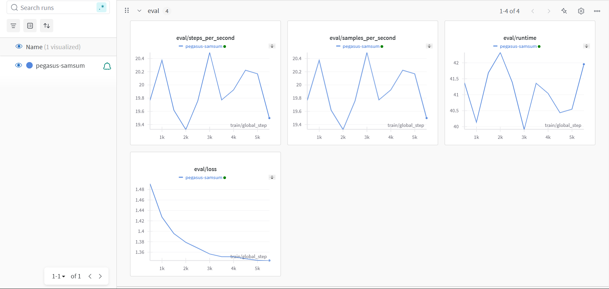

# 🚀 Text Summarization by Fine-Tuning a Transformer Model | NLP | Hugging Face  

## 📌 Project Overview  
This project focuses on fine-tuning a transformer-based model for text summarization using the Hugging Face ecosystem. The model is trained on a dataset of text summaries to generate concise and meaningful summaries from longer pieces of text.  

## 🛠️ Technologies Used  
- 🤗 **Hugging Face** – Transformers, Datasets, and Tokenizers  
- 📊 **Weights & Biases (W&B)** – Experiment tracking and visualization  

## 📖 Features  
- Fine-tuning a transformer model for text summarization  
- Custom dataset preparation and preprocessing  
- Training with Weights & Biases for logging and visualization  
- Evaluation and inference for generating summaries  

## 📦 Installation  
To set up the project, clone the repository and install the required dependencies:  
```bash  
git clone https://github.com/Amr-Abdelaty-fathalla/text-summarization-transformer.git  
cd text-summarization-transformer  
pip install -r requirements.txt  
```

## 🚀 Training the Model  
Run the training script with Weights & Biases integration:  
```bash  
python train.py  
```

## 📊 Monitoring with W&B  
Track your training progress by logging into Weights & Biases:  
```bash  
wandb login  
```
Then visualize metrics and logs in the W&B dashboard.

### Example Training Results from W&B  
 

## 📝 Inference  
To generate summaries using the fine-tuned model:  
```bash  
python inference.py --text "Your input text here"  
```

## 📜 Dataset  
The dataset used for training can be specified in the `Samsung/samsum`.

## 📌 Evaluation  
- The model is evaluated using ROUGE scores.  


## 🤝 Contributing  
Feel free to fork this repo, submit pull requests, or open issues for discussions.

